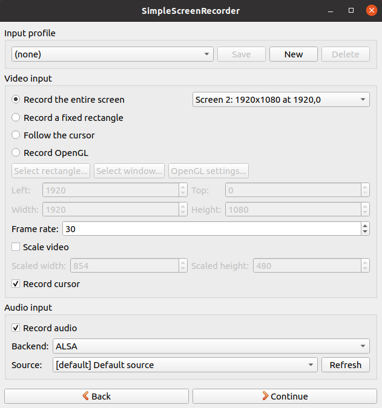

학교 자율차 lab실에서 새로 ubuntu를 세팅하면서 이전에 잘 되지 않았던 것들에 대해서 다시 진행해보는 시간을 가졌다.  
그 중에서 항상 수업 녹화를 이전에 했을 때 소리가 녹화가 되자 않아서 수업 녹화를 할때 마다 컴퓨터를 끄고 windows에서 녹화를 해야하는 것이 여간 귀찮은 일이 아니였다.  

때문에 이번에 하는 김에 ubuntu 비디오 녹화를 꼭 해야겠다는 생각이 들어 다시 도전하게되었다.  
사실 그냥 간단히 해결되어서 양이 많지 않다 ㅋㅋ  

1. simplerecoder  

이전에도 이 프로그램을 이용하여 녹화를 하였지만 소리가 들리지 않았었다.  

하지만 audio 설정 부분에서 ALSA 로 audio source를 바꾼뒤 default source로 audio input 설정을 하였더니 시스템 소리가 잘 녹화가 되는 것이다.  

혹시 안된다면 이렇게 audio 설정을 해보자. 마법 같이 바뀐다.  

- 추가 설정 참고 사이트  
output file을 mp4로 설정 할 때 ubuntu 에서 실행이 안되는 경우  
  : https://askubuntu.com/questions/214421/how-to-install-the-mpeg-4-aac-decoder-and-the-h-264-decoder
